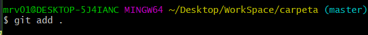

# Prácticas A y B , procedimiento para solucionarlas:
---
1.Crear un directorio y dentro del mismo crear un archivo de texto.

---
2.Damos click derecho y en el menu desplegado seleccionamos _*Git Bash Here*_.


---
3.Ejecutamso el comando ```git init```.


---
4.Comprobamos el estado del _WorkSpace_ ejecutando el comando ```git status - s``` , donde observamos que nuestro archivo no ha sido indexado,es decir, no tiene seguimiento.


---
5.Procedemos a ejecutar el comando ```git add``` seguido del nombre de nuestro archivo o ```git add .``` e indexamos todos los archivos y directorios del _WorkSpace_.


---
6.Ejecutamos nuevamente el comando ```git status -s``` y comprobamos que justo al lado de el archivo aparece una _(A)_ de color verde indicando que el archivo se encuentra en _(staged area)_, es decir ,_esta indexado_ listo para formar parte del historial de cambios del proyecto.


---
7.Ejecutamos el comando  ```git commit -m "Aqui podemos poner cualquier mensaje"``` eviando nuestro archivo de texo a _(Local Repository)_, es decir, nuestro historial de cambios o podria asociarse tambien con fotos de nuestro codigo.


---
8.Si ejecutamos el comando ```git status -s``` esta vez no nos saldra ningun archivo , lo que indica que todos estan en _(Local Repository)_ y desde el ultimo cambio que guardamos,no hubo ninguno mas.


---
9.Si deseamos ver el historial de cambios a lo largo del tiempo podemos ejecutar el comando ```git log --oneline```.


---
10.Para poder subir dicho archivo a un repositorio externo como __GitHub__ o __GitLab__ debemos previamente crearnos un repositorio en el sitio web [GitHub](https://github.com/) o [GitLab](https://gitlab.com/) usando nuestra cuenta.

---
11.Una vez dentro y con nuestra cuenta creada , damos en el boton de nuevo repositorio.


---
12.Le damos un nombre


---
13.Damos en el boton crear 


---
14.Copiamos la url del repositorio


---
15.Nos dirigimos a la consola git y ejecutamos el comando ```git remote add origin``` _[url del repositorio](https://github.com/MRodriguezValdes/Ejercicios-A-y-B.git)_


---
16.Ejecutamos el comando ```git branch -M main```


---
17.Por ultimo ejecutamos el comando ```git push -u origin main```, si es primera vez que ejecutamos este comando en nuestro ordenador , nos solicitara las credenciales de nuestra cuenta en github.


---
18.Siguiendo los pasos anteriores ya tendriamos nuestro archivo en git hub 


# Git Lab

1.Manteniendo los pasos anteriores ,para subir nuestro archivo a _GitLab_ solo tendriamos que cambiar el repositorio remoto, utilizando el comando ```git remote add gitlab``` seguido del [url del repositorio](https://gitlab.com/MarcosRdguez/ejercicios-a-y-b.git) dode escribo gitlab puedes poner cualqier cosa.


2.Ejecutamos el comando ```git branch -M main```


3.Por ultimo ejecutamos el comando ```git push -u gitlab main```


Con los pasos anteriores tendriamos nuestro archivo en _GitLab_


# Modificaciones:
1.Esta linea ha sido insertada en _GitHub_ y posteriormente haré un ```commint``` de ella para actualizar los cambios en mi repositorio local haciendo uso del comando ```git pull orgin main ```

2.Si hacemos un cambio en el documento y antes de ejecutar el comando ```git add nombre_del_archivo``` ejecutamos el comando ```git checkout nombre_del_archivo``` todos los cambios se deshacen.

3.Si hacemos un cambio en el documento y luego ejecutamos el comando ```git add nombre_del_documento``` y autoseguido intentamos lo comentado anteriormente ```git checkout nombre_del_archivo``` observamos que no sucede nada porque ya hemos indexado el archivo, es decir , ahora se encuentra en la _(staged area)_ y primero debemos sacarlo de ahi para poder ejecutar el comando anterior , para ello, hacemos uso del comando ```git reset HEAD nombre_del_archivo``` y luego aplicamos el comando ```git checkout nombre_del_archivo``` y observamos que todos los cambios en el documento se deshacen.

4.Para regresar a una version especifica de un archivo de forma temporal ejecutamos el comando ```git checkout hash_del archivo nombre_del_archivo```

- El hash del archivo en sus diferentes versiones podemos buscarlo en:
    
    - _GitHub_:Damos click en el archivo y luego nos dirigimos a _history_,donde encontramos las diferentes versiones del mismo y podemos acceder al hash que deseemos.
    - Ejecutando el comando ```git log -- oneline``` nos sale justo al lado de cada commit.


5.Podemos regresar a una fase del proyecto de forma permanente ejecutando el comando ```git reset --hard hash_del_commit```


6.Si perdemos nuestro proyecto y lo tenemos en github podemos clonarlo al directorio que deseemos haciendo uso del comando ```git clone``` [url del proyecto](https://github.com/MRodriguezValdes/Ejercicios-A-y-B.git)